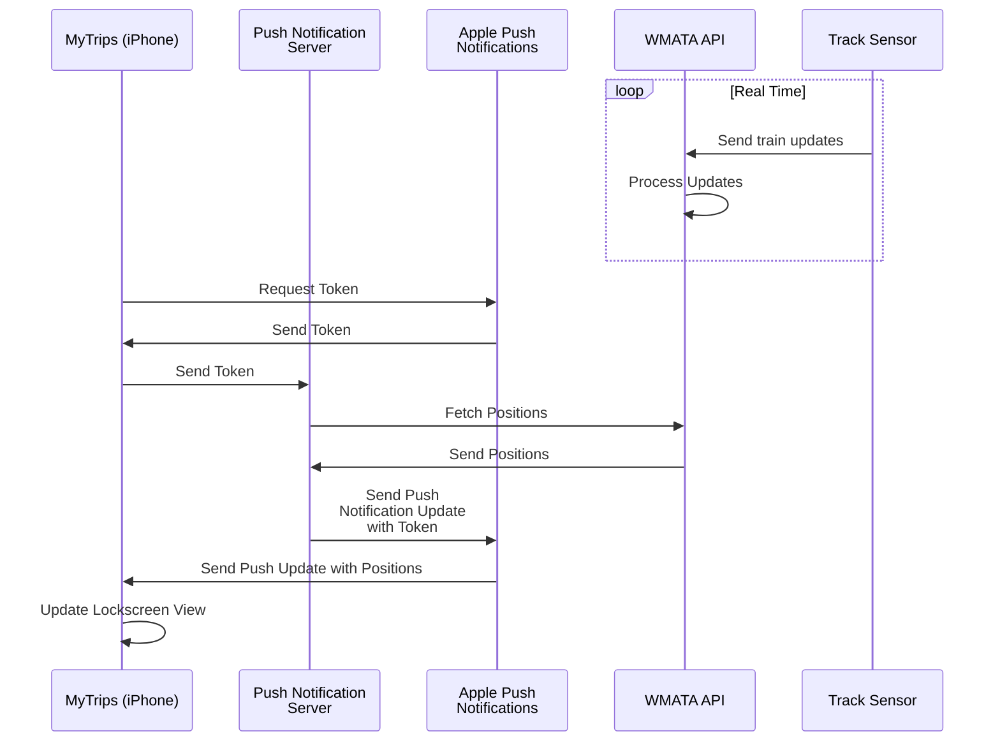

```mermaid
sequenceDiagram

    participant MyTrips as MyTrips (iPhone)
    participant PNS as Push Notification <br> Server
    participant APN as Apple Push <br> Notifications
    participant WAPI as WMATA API
    participant TS as Track Sensor


    loop Real Time 
    TS ->> WAPI: Send train updates
    WAPI ->> WAPI: Process Updates
    end

    MyTrips ->> APN: Request Token
    APN ->> MyTrips: Send Token
    
    MyTrips ->> PNS: Send Token
    PNS ->> WAPI: Fetch Positions
    WAPI ->> PNS: Send Positions

    PNS ->> APN: Send Push <br> Notification Update <br> with Token

    APN ->> MyTrips: Send Push Update with Positions

    MyTrips ->> MyTrips: Update Lockscreen View


```