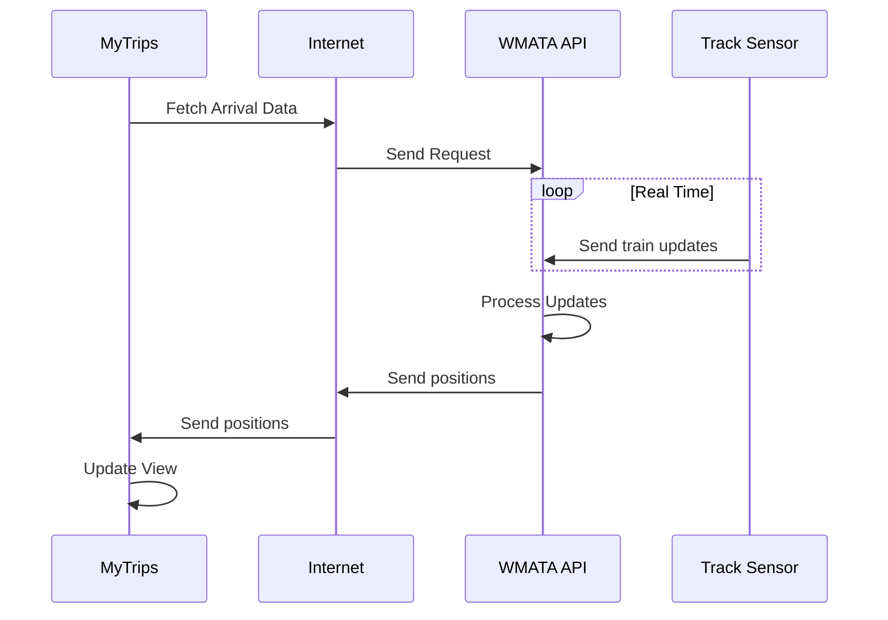

```mermaid
sequenceDiagram

    participant MyTrips
    participant Internet
    participant WAPI as WMATA API
    participant TS as Track Sensor

    MyTrips ->> Internet: Fetch Arrival Data
    Internet ->> WAPI: Send Request

    loop Real Time 
    TS ->> WAPI: Send train updates
    end

    WAPI ->> WAPI: Process Updates

    WAPI ->> Internet: Send positions
    Internet ->> MyTrips: Send positions

    MyTrips ->> MyTrips: Update View


```